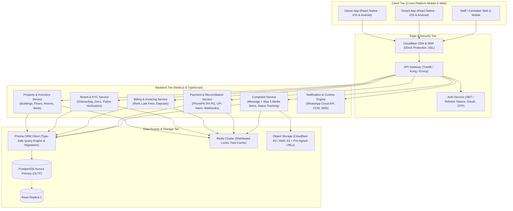

# PG Flow — Enterprise PG & Coliving Management Ecosystem
## Comprehensive Architectural Blueprint & Engineering Specification

---

## 1. Executive Summary & Real-Life PG Problem Landscape

Managing a Paying Guest (PG) or Coliving facility is notoriously chaotic when done via paper registers, physical door knocks, and disconnected WhatsApp chats. The core pain points this platform eliminates include:

1. **Door-to-Door Rent Chasing & Inconsistent Records**:
   - Owners hate awkward collection visits; tenants make partial payments, pay in cash, or forget due dates.
   - *Solution*: Automated ledger, automated WhatsApp/SMS/Push reminders, zero-fee UPI payment links, and instant digital rent receipts.
2. **Bed-Level Inventory vs Room-Level**:
   - Unlike hotels (which rent rooms), PGs rent *beds* (1-sharing, 2-sharing, 3-sharing, 4-sharing, with gender segregation per room/floor).
   - *Solution*: Multi-tier hierarchical mapping: `Organization -> Property/Building -> Floor -> Room -> Bed`. Real-time bed occupancy status (Vacant, Occupied, Reserved, Maintenance).
3. **Multi-Property Overhead**:
   - Successful PG operators run 2 to 30+ buildings across a city. Switching contexts without logging out is critical.
   - *Solution*: Universal building switcher dropdown at the top with property-scoped analytics, staff permissions, and aggregated cross-property financials.
4. **Maintenance & Complaint Management (Simplified)**:
   - Tenants need an easy way to report broken fixtures, WiFi drops, or cleaning issues without lengthy phone calls.
   - *Solution*: Simple in-app complaint creation: A clear text message + up to 3 media items (photos or short video). Owner/staff can see the issue, track status (`Open` ➔ `In Progress` ➔ `Resolved`), and resolve it promptly.
5. **Zero Transaction Fee Rent Collection**:
   - Traditional card payment gateways charge 1.5% to 2% + GST. On ₹10,000 rent, losing ₹200+ per tenant per month is unacceptable to PG owners.
   - *Solution*: **Zero-MDR UPI payment infrastructure** (similar to Blinkit, Zepto, Swiggy) utilizing PhonePe PG, Direct UPI Deep Links, Dynamic UPI QR, and flat-fee virtual accounts.
6. **Digital KYC, Agreement & Security Deposit Reconciliation**:
   - Aadhaar/ID collection, security deposit intake, and clear deduction logging at checkout (notice period, damages).

---

## 2. Zero-Fee Payment Gateway Architecture (The "Blinkit Model")

How quick-commerce giants like Blinkit, Zepto, and Swiggy process millions of transactions with **0% or near-zero gateway fees**:

### 2.1 The Regulatory Foundation: NPCI 0% MDR Mandate
Under Government of India and NPCI (National Payments Corporation of India) regulations:
- **Standard UPI P2M (Peer-to-Merchant) transactions** (Bank Account to Bank Account) have **0% MDR (Merchant Discount Rate)**.
- Unlike Credit Cards or Netbanking (which charge 1.5% - 2.5%), **UPI payments incur ZERO percentage fees** for standard bank transfers.

### 2.2 Payment Gateway Options Comparison

| Gateway / Method | Transaction Fee | Setup / AMC Fee | Best For | How Blinkit / PGs Use It |
| :--- | :--- | :--- | :--- | :--- |
| **PhonePe Payment Gateway** | **0.00% on standard UPI** | ₹0 Setup, ₹0 AMC | **Top Recommendation for Mobile Apps** | Industry leader in UPI; offers instant mobile UPI Intent (opens GPay, PhonePe, Paytm, CRED directly) with 0% fee on UPI. |
| **Direct UPI Intent / Dynamic Bharat QR** | **0.00% (Strictly ₹0)** | ₹0 | **Direct Owner Bank Transfer** | Deep-links via `upi://pay?pa=owner@bank...`. Money goes directly from tenant's bank to owner's bank account with zero middleman fee. |
| **Cashfree / Razorpay Smart Collect** | **Flat ₹2 to ₹4 per tx** *(NOT 2%)* | Nominal API fee | **Automated Bank Reconciliation** | Provides unique Virtual Bank Account (Van) & Virtual UPI ID per tenant. Even for NEFT/IMPS, charges flat ₹3, not 2% (₹3 on ₹10,000 = 0.03%). |
| **PayU / Easebuzz (Hostel Tier)** | **0.00% on UPI** (Special rate) | ₹0 for qualifying MSMEs | **Education / PG Vertical** | Direct settlement to owner's current account with automated webhooks. |

### 2.3 Recommended Dual-Payment Routing Engine:
1. **Primary Route (0% Fee - In-App UPI Intent & Dynamic QR)**:
   - Tenant clicks "Pay Rent ₹8,500".
   - The app triggers the **PhonePe React Native SDK** or native **UPI Intent** (`upi://pay`).
   - The tenant selects their preferred UPI app (Google Pay, PhonePe, Paytm, CRED).
   - Payment is verified instantly via webhook. **Transaction fee: ₹0.00**.
2. **Secondary Route (Flat ₹2-₹3 Fee - Virtual Account for Parents / Net Banking)**:
   - For tenants whose parents transfer directly via NEFT/IMPS or net banking.
   - The tenant has a dedicated virtual account number (e.g., `PGFLOW10101` at ICICI/Yes Bank).
   - Node.js backend receives webhook and marks the rent invoice **PAID** automatically.

---

## 3. High-Level System Architecture (Scale: Millions of Users)



---

## 4. Technology Stack Selection

| Layer | Chosen Technology | Rationale for High Scale & Mobile Support |
| :--- | :--- | :--- |
| **Mobile Apps (Frontend)** | **React Native (Expo / TypeScript)** | Single codebase for iOS and Android with fast native rendering, seamless Camera/Media picker for up to 3 photos/video, native UPI Intent integration, and unified UI. |
| **Backend Runtime** | **Node.js (NestJS / Fastify / Express) + TypeScript** | High-throughput asynchronous event-loop architecture, rich ecosystem, type-sharing with React Native frontend. |
| **Database ORM** | **Prisma ORM** | Auto-generated type-safe database queries, automated SQL migrations (`prisma migrate`), zero SQL-injection risks, and relations management. |
| **Primary Database** | **PostgreSQL (AWS Aurora / Supabase / RDS)** | Rock-solid ACID transactions for financial ledgers, JSONB for flexible attributes, partitioned tables by `property_id` for horizontal scaling. |
| **Cache & Locks** | **Redis Cluster** | Distributed locking (Redlock) to prevent bed double-booking; sub-millisecond room availability caching. |
| **Event Bus & Queues** | **BullMQ / Redis or RabbitMQ** | Decoupling batch invoice generation, push notifications, WhatsApp alerts, and payment webhook processing. |
| **Media Storage** | **Cloudflare R2 / AWS S3 + CDN** | Zero-egress fees (R2), direct pre-signed client uploads (server never touches raw video files), fast CDN delivery. |
| **Zero-Fee Payments** | **PhonePe PG / Direct UPI Intent** | 0.00% transaction fee on standard UPI; instant settlement; high success rates. |
| **Notifications** | **Firebase (FCM), Apple APNs, Meta WhatsApp Cloud API** | Omnichannel alerts for rent due dates, receipts, and complaint status updates. |

---

## 5. Complete Prisma Schema (`schema.prisma`)

Below is the production-ready Prisma schema modeling the full multi-property hierarchy, bed inventory, billing ledger, and simplified complaint flow:

```prisma
// This is your Prisma schema file
datasource db {
  provider = "postgresql"
  url      = env("DATABASE_URL")
}

generator client {
  provider = "prisma-client-js"
}

// 1. PG Owner Organization
model Organization {
  id          String     @id @default(uuid())
  name        String
  ownerPhone  String     @unique
  ownerEmail  String?    @unique
  gstNumber   String?
  createdAt   DateTime   @default(now())
  updatedAt   DateTime   @updatedAt

  properties  Property[]
  users       User[]

  @@map("organizations")
}

enum UserRole {
  OWNER
  CARETAKER
  MAINTENANCE_STAFF
  TENANT
}

// System Users (Owners, Caretakers, Tenants)
model User {
  id             String        @id @default(uuid())
  organizationId String?
  fullName       String
  phone          String        @unique
  email          String?       @unique
  role           UserRole      @default(TENANT)
  passwordHash   String?
  isActive       Boolean       @default(true)
  createdAt      DateTime      @default(now())
  updatedAt      DateTime      @updatedAt

  organization   Organization? @relation(fields: [organizationId], references: [id], onDelete: Cascade)
  tenantProfile  Tenant?
  assignedComplaints Complaint[] @relation("AssignedStaff")

  @@map("users")
}

enum GenderType {
  MALE
  FEMALE
  UNISEX
}

// 2. Property / Building (Top dropdown switcher target)
model Property {
  id             String      @id @default(uuid())
  organizationId String
  name           String      // e.g. "Sunshine Boys PG - HSR Layout"
  address        String
  city           String
  genderType     GenderType  @default(UNISEX)
  totalFloors    Int         @default(1)
  amenities      String[]    // ["WiFi", "RO Water", "CCTV", "Washing Machine"]
  createdAt      DateTime    @default(now())
  updatedAt      DateTime    @updatedAt

  organization   Organization @relation(fields: [organizationId], references: [id], onDelete: Cascade)
  floors         Floor[]
  rooms          Room[]
  complaints     Complaint[]

  @@map("properties")
}

// 3. Floor
model Floor {
  id          String    @id @default(uuid())
  propertyId  String
  floorNumber Int       // 0 for Ground, 1 for 1st floor, etc.
  name        String?   // "Ground Floor", "1st Floor"

  property    Property  @relation(fields: [propertyId], references: [id], onDelete: Cascade)
  rooms       Room[]

  @@map("floors")
}

enum RoomType {
  SINGLE
  DOUBLE
  TRIPLE
  FOUR_SHARING
}

// 4. Room
model Room {
  id            String    @id @default(uuid())
  propertyId    String
  floorId       String
  roomNumber    String    // e.g. "101", "204"
  roomType      RoomType  @default(DOUBLE)
  baseRent      Decimal   @db.Decimal(10, 2)
  hasAttachedBath Boolean @default(true)
  hasAc         Boolean   @default(false)
  createdAt     DateTime  @default(now())

  property      Property  @relation(fields: [propertyId], references: [id], onDelete: Cascade)
  floor         Floor     @relation(fields: [floorId], references: [id], onDelete: Cascade)
  beds          Bed[]
  complaints    Complaint[]

  @@map("rooms")
}

enum BedStatus {
  VACANT
  OCCUPIED
  RESERVED
  MAINTENANCE
}

// 5. Bed (Granular booking unit in PGs)
model Bed {
  id         String     @id @default(uuid())
  roomId     String
  bedNumber  String     // "101-A", "101-B"
  status     BedStatus  @default(VACANT)
  customRent Decimal?   @db.Decimal(10, 2)
  createdAt  DateTime   @default(now())

  room       Room       @relation(fields: [roomId], references: [id], onDelete: Cascade)
  stays      TenantStay[]

  @@map("beds")
}

enum KycStatus {
  PENDING
  VERIFIED
  REJECTED
}

// 6. Tenant Profile
model Tenant {
  id             String       @id @default(uuid())
  userId         String       @unique
  emergencyPhone String?
  kycStatus      KycStatus    @default(PENDING)
  aadhaarNumber  String?
  idProofUrls    String[]
  createdAt      DateTime     @default(now())

  user           User         @relation(fields: [userId], references: [id], onDelete: Cascade)
  stays          TenantStay[]
  complaints     Complaint[]

  @@map("tenants")
}

enum StayStatus {
  ACTIVE
  NOTICE_PERIOD
  CHECKED_OUT
}

// 7. Tenant Stay (Contract mapping tenant to bed)
model TenantStay {
  id                String      @id @default(uuid())
  tenantId          String
  bedId             String
  checkInDate       DateTime
  checkOutDate      DateTime?
  agreedRent        Decimal     @db.Decimal(10, 2)
  securityDeposit   Decimal     @db.Decimal(10, 2)
  depositRefunded   Decimal?    @db.Decimal(10, 2)
  status            StayStatus  @default(ACTIVE)
  createdAt         DateTime    @default(now())

  tenant            Tenant      @relation(fields: [tenantId], references: [id], onDelete: Cascade)
  bed               Bed         @relation(fields: [bedId], references: [id])
  invoices          Invoice[]

  @@map("tenant_stays")
}

enum InvoiceStatus {
  PENDING
  PARTIALLY_PAID
  PAID
  OVERDUE
}

// 8. Invoicing & Rent Ledger
model Invoice {
  id           String        @id @default(uuid())
  tenantStayId String
  invoiceNumber String       @unique
  billingMonth String        // "2026-10"
  rentAmount   Decimal       @db.Decimal(10, 2)
  lateFine     Decimal       @default(0) @db.Decimal(10, 2)
  totalDue     Decimal       @db.Decimal(10, 2)
  amountPaid   Decimal       @default(0) @db.Decimal(10, 2)
  status       InvoiceStatus @default(PENDING)
  dueDate      DateTime
  paidAt       DateTime?
  createdAt    DateTime      @default(now())

  stay         TenantStay    @relation(fields: [tenantStayId], references: [id], onDelete: Cascade)
  payments     PaymentTransaction[]

  @@map("invoices")
}

enum PaymentMode {
  UPI_PHONEPE
  UPI_INTENT
  VIRTUAL_ACCOUNT
  CASH
}

enum PaymentStatus {
  PENDING
  SUCCESS
  FAILED
}

// 9. Payment Transactions (Zero-fee reconciliation)
model PaymentTransaction {
  id             String        @id @default(uuid())
  invoiceId      String
  gatewayTxnId   String?       @unique // PhonePe / Bank UTR
  paymentMode    PaymentMode   @default(UPI_PHONEPE)
  amount         Decimal       @db.Decimal(10, 2)
  status         PaymentStatus @default(PENDING)
  feeDeducted    Decimal       @default(0) @db.Decimal(10, 2) // Typically 0.00 on UPI
  settledAt      DateTime?
  createdAt      DateTime      @default(now())

  invoice        Invoice       @relation(fields: [invoiceId], references: [id], onDelete: Cascade)

  @@map("payment_transactions")
}

enum ComplaintStatus {
  OPEN
  IN_PROGRESS
  RESOLVED
}

// 10. Simplified Complaint Management (Message + Max 3 Media)
model Complaint {
  id              String          @id @default(uuid())
  propertyId      String
  roomId          String?
  tenantId        String
  assignedStaffId String?
  category        String          // "PLUMBING", "ELECTRICAL", "WIFI", "CLEANING", "OTHER"
  message         String          @db.Text
  mediaUrls       String[]        // Max 3 media URLs (Photos or Video)
  status          ComplaintStatus @default(OPEN)
  createdAt       DateTime        @default(now())
  updatedAt       DateTime        @updatedAt
  resolvedAt      DateTime?

  property        Property        @relation(fields: [propertyId], references: [id], onDelete: Cascade)
  room            Room?           @relation(fields: [roomId], references: [id], onDelete: SetNull)
  tenant          Tenant          @relation(fields: [tenantId], references: [id], onDelete: Cascade)
  assignedStaff   User?           @relation("AssignedStaff", fields: [assignedStaffId], references: [id], onDelete: SetNull)

  @@map("complaints")
}
```

---

## 6. End-to-End Functional Modules

### 6.1 Multi-Building Switcher & Dashboard (Owner Experience)
- **Top Dropdown Switcher**:
  - Global view ("All Buildings Summary") or single building focus ("Sunshine PG - Boys Wing").
  - Powered by Prisma query:
    ```typescript
    // Fetch property scoped dashboard metrics
    const propertySummary = await prisma.property.findUnique({
      where: { id: selectedPropertyId },
      include: {
        rooms: {
          include: {
            beds: true,
          },
        },
        complaints: {
          where: { status: { in: ['OPEN', 'IN_PROGRESS'] } },
        },
      },
    });
    ```
- **Executive Dashboard Metrics**:
  - **Occupancy Rate**: Real-time counter (e.g., 84/100 beds filled, 16 vacant beds).
  - **Financial Summary**: Total expected rent vs collected rent vs overdue balance.
  - **Pending Dues Counter**: List of tenants with overdue rent and 1-click WhatsApp reminder.
  - **Complaint Counter**: Number of Open, In Progress, and Resolved issues.
  - **Upcoming Vacancies**: Beds freeing up soon due to notice periods.

### 6.2 Room & Bed Inventory Engine
- Visual grid of floors and rooms.
- Color-coded bed markers: 
  - 🟢 Green: Vacant & Ready
  - 🔴 Red: Occupied
  - 🟡 Yellow: Reserved / Token paid
  - 🟣 Purple: Notice period (available soon)
  - ⚪ Grey: Under repair/cleaning
- 1-click bed shifting: Seamlessly transfer a tenant to another room/bed without losing billing history.

### 6.3 Automated Invoicing & Zero-Fee Rent Collection
- **Automated Monthly Billing**: On the 1st of every month, draft invoices are generated for all active stays via Node.js batch job.
- **Zero-Knock Collection**:
  - Automated WhatsApp message sent 3 days before due date with direct UPI payment link.
  - In-app 1-tap UPI payment via PhonePe React Native SDK / UPI Intent (0% transaction fee).
  - Instant digital rent receipt generated upon successful payment webhook.
  - In-app cash ledger: If a tenant pays offline cash, owner marks "Received Cash" with an OTP confirmation sent to tenant.

### 6.4 React Native Tenant App & Simplified Complaint System
- **Rent Portal**: Clean display of current dues, due date, 1-tap UPI pay, and downloadable PDF receipts.
- **Simplified Complaint Module**:
  - Tenant enters a **Message** describing the issue (e.g., "WiFi on 2nd floor is not connecting").
  - Tenant selects **up to 3 media items** using `expo-image-picker` (camera or gallery; photos or short video).
  - Uploads directly to Cloudflare R2 / AWS S3 using pre-signed URLs.
  - Real-time status badge:
    - 🟡 **Open**: Ticket received by owner/caretaker.
    - 🔵 **In Progress**: Work underway.
    - 🟢 **Resolved**: Issue fixed.

---

## 7. High-Scale Engineering Strategies (Millions of Users)

### 7.1 Direct-to-Cloud Pre-signed Media Uploads
To prevent Node.js servers from choking when thousands of tenants upload media simultaneously:
1. React Native App requests an upload token: `POST /api/v1/complaints/presigned-url` (validating max 3 items).
2. Node.js backend validates auth and generates a Cloudflare R2 / AWS S3 pre-signed PUT URL with a 5-minute expiry.
3. React Native app uploads media directly to object storage.
4. An async worker compresses images and generates video thumbnails. The Node.js API server never touches raw video files.

### 7.2 Preventing Double-Booking Race Conditions (Node.js + Redis)
When multiple inquiries or caretakers try to allocate the same vacant bed:
```typescript
import { Redis } from 'ioredis';
const redis = new Redis(process.env.REDIS_URL);

export async function allocateBedWithLock(bedId: string, tenantId: string) {
  const lockKey = `lock:bed:${bedId}`;
  
  // Acquire distributed lock for 60 seconds
  const acquired = await redis.set(lockKey, tenantId, 'EX', 60, 'NX');
  if (!acquired) {
    throw new Error('This bed is currently being booked by another user. Please choose another bed.');
  }

  try {
    return await prisma.$transaction(async (tx) => {
      const bed = await tx.bed.findUnique({ where: { id: bedId } });
      if (bed.status !== 'VACANT') {
        throw new Error('Bed is no longer available');
      }

      await tx.bed.update({
        where: { id: bedId },
        data: { status: 'OCCUPIED' },
      });

      return await tx.tenantStay.create({
        data: {
          tenantId,
          bedId,
          checkInDate: new Date(),
          agreedRent: bed.customRent || 8500,
          securityDeposit: 10000,
          status: 'ACTIVE',
        },
      });
    });
  } finally {
    // Release the lock
    await redis.del(lockKey);
  }
}
```

### 7.3 High-Throughput Prisma & Connection Pooling
- For millions of users, PostgreSQL connections are pooled using **PgBouncer** or **Prisma Accelerate**.
- Read replicas handle dashboard read traffic (`prismaReadClient`), while writes go to the primary instance.

---

## 8. Implementation Roadmap

| Phase | Milestone | Deliverables |
| :--- | :--- | :--- |
| **Phase 1: Foundation & Prisma Schema** *(Weeks 1-4)* | Database & Backend Core | • Setup Node.js backend with TypeScript & Prisma ORM<br/>• Execute database migrations for Organizations, Properties, Rooms, and Beds<br/>• Multi-property hierarchy & building switcher APIs |
| **Phase 2: Billing & Zero-Fee Payments** *(Weeks 5-8)* | Automated Financials | • Automated monthly rent invoice engine (Node.js cron / BullMQ)<br/>• PhonePe PG / UPI Intent integration (0% fee)<br/>• Digital receipts & Cash payment ledger<br/>• WhatsApp rent reminder engine |
| **Phase 3: React Native Mobile Apps** *(Weeks 9-12)* | Owner & Tenant Apps | • React Native (iOS & Android) with building switcher dropdown<br/>• Floor/Room/Bed visual status grid<br/>• Complaint portal (Message + Max 3 photos/video)<br/>• Real-time ticket status tracking (`Open` ➔ `In Progress` ➔ `Resolved`) |
| **Phase 4: Scale & Enterprise** *(Weeks 13-16)* | Enterprise Scale & Optimization | • Direct-to-S3 pre-signed media pipeline<br/>• Redis Redlock & PostgreSQL connection pooling<br/>• Real-time occupancy & revenue analytics |

---

## 9. SaaS Subscription Governance & Modular Component Architecture

### 9.1 Multi-Tenant Subscription System
- **Tier Quota Enforcement**:
  - `Starter`: 1 PG Property, 50 Beds maximum.
  - `Growth`: 3 PG Properties, 150 Beds maximum.
  - `Enterprise`: Unlimited PG Properties & Beds.
- **Self-Service Owner APIs**:
  - `GET /api/auth/plans`: List public SaaS subscription tiers.
  - `GET /api/auth/subscription`: Current organization plan, status, days left, and live quota usage.
  - `POST /api/auth/subscription/renew`: Extend subscription validity (`+1`, `+3`, `+6`, `+12` months).
  - `POST /api/auth/subscription/upgrade`: Upgrade to higher tier with monthly/annual billing.

### 9.2 Frontend Modular Decomposition Rule
- Complex modals and views are strictly broken into single-responsibility subcomponents:
  - `src/components/subscription/CurrentPlanHeroCard.tsx`: Active plan status, days countdown, and quota utilization bars.
  - `src/components/subscription/RenewalDurationPicker.tsx`: Validity extension selector.
  - `src/components/subscription/UpgradeTierConfirmation.tsx`: Billing cycle selector & upgrade confirmation.
  - `src/components/subscription/AvailablePlanCard.tsx`: Individual tier feature card.
- All flex-container children maintain `flex-shrink: 0` to prevent layout collapse in scrollable dialogs.

